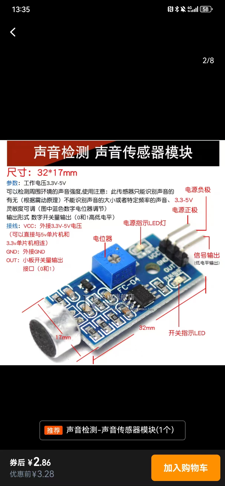

# pi5-soundsensor-tools

本仓库提供一个简单示例，说明如何在树莓派 5（Raspberry Pi 5）上读取声音传感器。

## 接线

下图展示了接线方式。声音传感器板通常有 `VCC`、`GND` 和 `OUT` 三个引脚，与树莓派的连接如下：



- `VCC` → 引脚 1 (3.3 V)
- `GND` → 引脚 6 (GND)
- `OUT` → 引脚 11 (GPIO17)

在直接连接到 GPIO 引脚之前，请确保传感器的输出电压兼容 3.3 V。

## 示例

脚本 `example.py` 会在传感器检测到声音时打印一条消息。安装 `RPi.GPIO` 包并运行脚本：

```bash
pip install RPi.GPIO
python example.py
```

如果你使用不同的 GPIO 引脚，请在脚本中修改 `PIN_SOUND` 常量。
